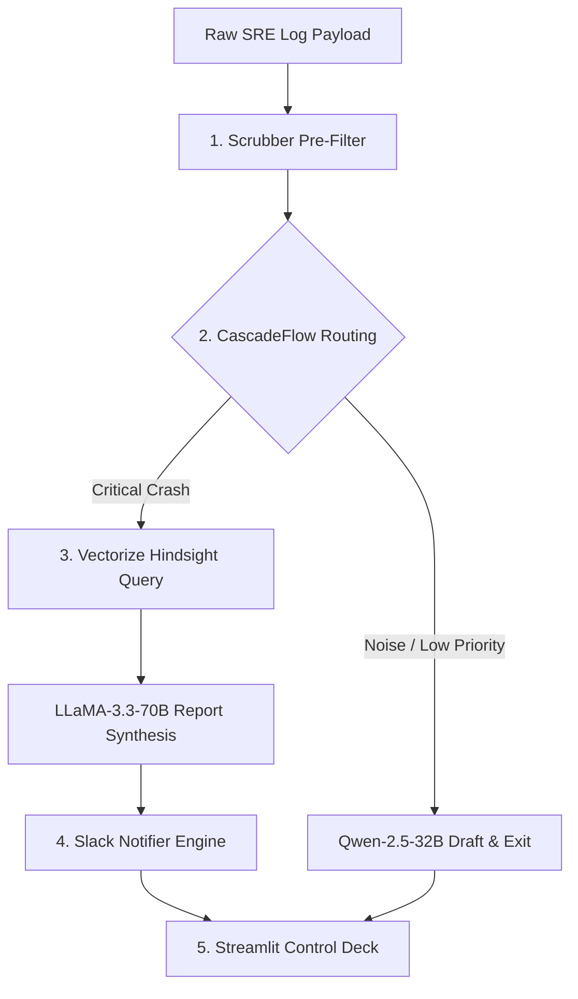

# 🧠 DevMemory Agent

An autonomous, production-grade SRE log ingestion, cost-optimization routing, and persistent memory synthesis pipeline built on the Google Antigravity framework.

## 🚀 Live Production Links
- **Public Live Dashboard:** [https://share.streamlit.io/codernoob000/devmemory-agent/main/src/ui/app.py](https://share.streamlit.io/codernoob000/devmemory-agent/main/src/ui/app.py)
- **Core Repository Build:** `https://github.com/Codernoob000/devmemory-agent`

---

## 💡 The Core Architectural Problem: "Corporate Amnesia"

In modern cloud-native systems, production environments generate a massive volume of log data. When fatal database bottlenecks or network outages strike, traditional log aggregators flood SRE channels with redundant, noisy alert dumps. The core issue is **"Corporate Amnesia"**: engineering teams repeatedly spend hours re-diagnosing identical, recurring system exceptions that have already been resolved in prior sessions. Each subsequent incident is treated as a clean slate, incurring massive downtime and wasting expensive developer hours.

At the same time, naive AI-driven anomaly detection architectures suffer from prohibitive API costs. Escalating every log trace to high-tier reasoning LLMs rapidly exhausts enterprise token budgets on normal startup logs or non-critical background warnings. **DevMemory Agent** solves this by routing logs through **CascadeFlow**, a deterministic pre-filter and dual-tier model gate. If an incident similarity match is discovered inside our long-term memory layer (**Vectorize Hindsight**), the system automatically pulls past resolution steps, saving expensive API credits while accelerating Mean Time to Resolution (MTTR).

---

## 🛠️ Deep-Dive System Architecture Components

The DevMemory Agent pipeline is divided into five core operational components, coordinating to process raw log payloads safely:



### 1. 🚦 Deterministic Log Pre-Processing & Scrubbing ([scrubber.py](file:///c:/Users/Lenovo/OneDrive/Desktop/devmemory-agent/src/pipeline/scrubber.py))
* **Role**: Sanitizes raw log payloads before they exit the secure enterprise network perimeter or reach LLM APIs.
* **Logic & Data Flow**: Executes a strict, multi-pass regex scanning engine designed to identify and redact credentials, JWT tokens, AWS keys, database connection URIs, and PII. 
* **Key Methods**: [deterministic_scrub](file:///c:/Users/Lenovo/OneDrive/Desktop/devmemory-agent/src/pipeline/scrubber.py#L9) isolates sensitive patterns and replaces them with standard secure markers (e.g., `[REDACTED_API_KEY]`), guaranteeing compliance.

### 2. 🏎️ Cascadeflow Cost-Control Sentinel Routing Gate ([ingest.py](file:///c:/Users/Lenovo/OneDrive/Desktop/devmemory-agent/src/pipeline/ingest.py) & [main.py](file:///c:/Users/Lenovo/OneDrive/Desktop/devmemory-agent/src/core/main.py))
* **Role**: Evaluates the severity of ingested events to prevent token budget exhaustion.
* **Logic & Data Flow**: Receives the clean log data. A fast, low-cost classifier ([Qwen-2.5-32B](file:///c:/Users/Lenovo/OneDrive/Desktop/devmemory-agent/src/core/main.py#L125)) classifies the error signature, determines if it is a crash, and assigns a severity rating (`NONE`, `LOW`, `MEDIUM`, `HIGH`, `CRITICAL`).
* **Intelligent Routing**: Routine informational entries or minor warnings are processed by the fast classifier and terminated early. Critical runtime crashes are escalated to the flagship reasoning model ([LLaMA-3.3-70B](file:///c:/Users/Lenovo/OneDrive/Desktop/devmemory-agent/src/core/main.py#L208)) for post-mortem synthesis.

### 3. 💾 Vectorize Hindsight Persistent Memory Asset ([manager.py](file:///c:/Users/Lenovo/OneDrive/Desktop/devmemory-agent/src/memory/manager.py))
* **Role**: Serves as our persistent long-term memory layer, indexing past SRE outage incident resolutions.
* **Logic & Data Flow**: Implements `LocalSemanticEngine`, a pure-Python TF-IDF Vectorizer and Cosine Similarity matcher. It tokenizes exception patterns and filters programming noise (e.g., `Traceback`, `Line`).
* **Querying & Fallbacks**: During escalation, [query_past_resolutions](file:///c:/Users/Lenovo/OneDrive/Desktop/devmemory-agent/src/memory/manager.py#L268) queries a remote vector database. If the network is offline, it fails back to local cosine distance matching. Matches exceeding the `0.30` threshold are injected into the LLM synthesis prompt.

### 4. 📢 Real-Time Slack Telemetry Notification Engine ([notifier.py](file:///c:/Users/Lenovo/OneDrive/Desktop/devmemory-agent/src/pipeline/notifier.py))
* **Role**: Dispatches finalized post-mortem reports to developer channels.
* **Logic & Data Flow**: Receives the synthesized report Markdown and triggers a secure webhook POST request to the target SRE Slack channel (`#devmemory-alerts`).
* **Methods**: [send_slack_notification](file:///c:/Users/Lenovo/OneDrive/Desktop/devmemory-agent/src/pipeline/notifier.py#L8) handles connection pools, timeout parameters, and handles payload delivery securely.

### 5. 🎛️ Decision Audit Trail Cockpit UI Layer ([app.py](file:///c:/Users/Lenovo/OneDrive/Desktop/devmemory-agent/src/ui/app.py))
* **Role**: Serves as the developer cockpit dashboard built using native Streamlit columns, layout containers, and dataframes.
* **Logic & Data Flow**: Offers a sidebar for architecture status configuration. Allows developers to select simulated SRE scenarios, review generated Markdown post-mortems, track cumulative cost-savings metrics, and search the complete history in the **Detailed Historic Audits** table.

---

## 🔬 Core Validation Matrix (Comprehensive Test Cases)

| Test Case ID | Targeted Exception Payload / Log Source | Pipeline Routing Logic Execution Path | System Feature Verified |
| :--- | :--- | :--- | :--- |
| **TC-001** | `django.db.utils.OperationalError: Connection timeout...` | Raw Log Ingestion $\rightarrow$ Regex Scrubber $\rightarrow$ Qwen Classifier $\rightarrow$ **Noise / Low Priority** $\rightarrow$ Early Termination. | Early noise detection. Stops unnecessary LLM invocations for non-crash operational telemetry to save API credits. |
| **TC-002** | `sqlalchemy.exc.TimeoutError: QueuePool limit reached...` | Raw Log Ingestion $\rightarrow$ Regex Scrubber $\rightarrow$ Qwen Classifier $\rightarrow$ **High-Priority Escalation** $\rightarrow$ Hindsight Vector Query (Match Found) $\rightarrow$ LLaMA Synthesis $\rightarrow$ Slack Alert. | Connection pool leakage detection. Matches historical context vectors (Outage #INC-4412) to output a matching database fix. |
| **TC-003** | `redis.exceptions.ResponseError: OOM command not allowed...` | Raw Log Ingestion $\rightarrow$ Scrubber $\rightarrow$ Qwen $\rightarrow$ **Critical Escalation** $\rightarrow$ Hindsight Memory Query $\rightarrow$ LLaMA Synthesis $\rightarrow$ Slack Alert. | Memory limit verification. Evaluates Redis Outage #002 context and recommends switching from `noeviction` to `allkeys-lru`. |
| **TC-004** | `org.apache.kafka.consumer.CommitFailedException...` | Ingest $\rightarrow$ Scrubber $\rightarrow$ Qwen Classifier $\rightarrow$ **Escalation** $\rightarrow$ Hindsight Query $\rightarrow$ LLaMA Synthesis $\rightarrow$ Slack. | Rebalance storm identification. Pulls historical Kafka tuning details to recommend adjusting `max.poll.records`. |
| **TC-005** | `2026-06-27 INFO: redis duplicate BGSAVE warning...` | Ingest $\rightarrow$ Scrubber $\rightarrow$ Qwen Classifier $\rightarrow$ **Noise / Low Severity** $\rightarrow$ Immediate Pipeline Exit. | Warning noise control. Ignores duplicates BGSAVE alerts and logs telemetry safely without triggering flagship APIs. |
| **TC-006** | `RuntimeError: Task blocked pending on asyncio loop...` | Ingest $\rightarrow$ Scrubber $\rightarrow$ Qwen Classifier $\rightarrow$ **Escalation** $\rightarrow$ Hindsight Query $\rightarrow$ LLaMA Synthesis $\rightarrow$ Slack. | Starvation checks. Recommends offloading blocking crypto and synchronous HTTP calls to separate worker thread pool executors. |
| **TC-007** | `sqlalchemy.exc.OperationalError: Connection pool overflow 20` | Ingest $\rightarrow$ Scrubber $\rightarrow$ Qwen Classifier $\rightarrow$ **Escalation** $\rightarrow$ Hindsight Query (53% Similarity Match) $\rightarrow$ LLaMA Synthesis. | Semantic similarity verification. Matches a database crash vector containing connection pool timeouts. |

---

## 🏃‍♂️ Local Sandboxed Installation & Setup

Execute the commands below to launch the local project environment:

```bash
# Clone the repository
git clone https://github.com/Codernoob000/devmemory-agent.git
cd devmemory-agent

# Install dependencies
pip install -r requirements.txt

# Run the local server instance
streamlit run src/ui/app.py
```
